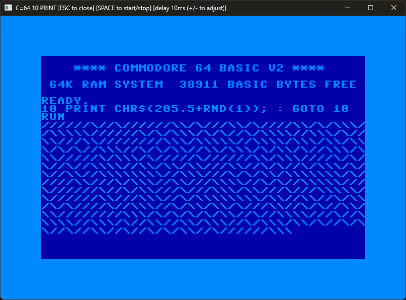

# abremir.C64.10-Print

Musings with the [Commodore 64](https://en.wikipedia.org/wiki/Commodore_64)'s `10 PRINT` program in C#

## Motivation

Some while ago I read the book [10 PRINT CHR$(205.5+RND(1)); : GOTO 10](https://10print.org/), which is focused on that same single line of [Commodore BASIC](https://en.wikipedia.org/wiki/Commodore_BASIC) code (set to run forever and generate a maze-like pattern on screen). And, since then, I wondered if I could get the same effect on a PC.

|  |
|:--:|
| *Commodore 64 `10 PRINT` program ([C64 Online Emulator](https://c64online.com/c64-online-emulator/))* |

The maze-like pattern is achieved through the random use of the characters `\` and `/`, and by how these characters are represented in the C64 [PETSCII](https://en.wikipedia.org/wiki/PETSCII) glyphs.

## Execution

I wanted to get the same effect as the one seen on the C64, but I wanted to have it written in C#.

For this I started with the simplest approach: use `System.Console`!

### Console

The pattern in C# can be generated with a bit of code as simple as

```csharp
var r = new Random();

while (true) {
    Console.Write((char)(random.Next(2) == 0 ? 47 : 92)); // ASCII code for / is 47 and for \ is 92
}
```

Also, if possible, I wanted to have the same "look and feel" as you would get if using a C64.

Unfortunately, this is not achievable using the system console.

|  |
|:--:|
| *[System.Console](./src/abremir.C64.10-Print-SystemConsole/) version of `10 PRINT` program* |

I was able to get the right colours (with the help of [PastelEx](https://github.com/k-iro/PastelEx)) and the right characters, but without the frame and without using the C64 font. The C64 font is part of what makes the maze-like pattern stand out.

Using the system console I was not able to use the correct font "out-of-the-box". For that, I would need to manually change the font of the console. And this was not something I wanted to do.

### The font

With the code to get the correct symbols on screen, I now needed a font to display them with a good enough visual resemblance to the C64.

After a few online searches I came about the [C64 TrueType Fonts](https://style64.org/c64-truetype), which is a "TrueType (TTF) representation of the C64 glyph set". I decided to use the `C64 Pro Mono` variant.

With the font "locked-down" I needed to find a UI framework that was cross-platform and allowed to easily display what I wanted on screen.

### SFML

And I found the [Simple and Fast Multimedia Library](https://www.sfml-dev.org/) (SFML), which is a multi-platform library that "provides a simple interface to the various components of your PC". Leveraging it with [TGUI.Net](https://tgui.net/) I was able to create the same "look and feel" as the C64.

|  |
|:--:|
| *[SFML](./src/abremir.C64.10-Print-SFML/) version of `10 PRINT` program* |

This looks close enough to the C64 with the expected maze-like pattern standing out, although it requires a bit of artificial padding to the right-hand side of the usable screen. Also, it depends on libraries compiled for the specific platform you want it to run on, and it does not run as a self-contained executable.

### Consolonia

As the search went on, I found [Consolonia](https://github.com/jinek/Consolonia) which is a "TUI (Text User Interface) (GUI Framework) implementation for Avalonia UI".

Unfortunately, it restricts the font to the one being used by the console and changing the library to allow custom fonts would mean rewriting part of the library, and including it in the solution as it would not be available as a NuGet package. As such, its usage was discarded.

### Avalonia UI

So, I started playing around with [Avalonia UI](https://www.avaloniaui.net/), which is a cross-platform UI framework, and it runs as a self-contained executable.

|  |
|:--:|
| *[Avalonia UI](./src/abremir.C64.10-Print-Avalonia/) version of `10 PRINT` program* |

This is similar to what was achieved with the usage of SFML, with the added benefit that the padding to the right-hand side of the usable screen is not needed, making this my closest implementation to the C64 "look and feel" of the `10 PRINT` program.

## Acknowledgements

- [ASCII](https://en.wikipedia.org/wiki/ASCII)
- [Avalonia UI](https://www.avaloniaui.net/)
- [C64 Online Emulator](https://c64online.com/c64-online-emulator/)
- [C64 TrueType Fonts](https://style64.org/c64-truetype)
- [Consolonia](https://github.com/jinek/Consolonia)
- [PastelEx](https://github.com/k-iro/PastelEx)
- [Simple and Fast Multimedia Library](https://www.sfml-dev.org/) (SFML), through [SFML.Net](https://www.sfml-dev.org/download/sfml.net/)
- [TGUI.Net](https://tgui.net/) - GUI library for SFML
